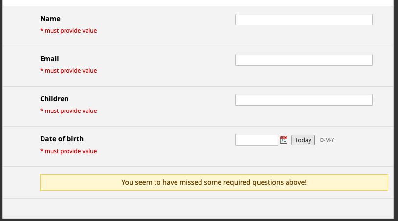
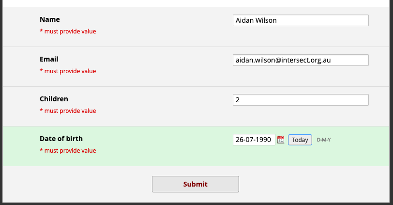

# HIDESUBMIT Action Tags

This REDCap External Module allows users to conditionally hide the Submit/Next Page button and the 'Take Survey Again' button on surveys and the save buttons on forms (all of which I refer to as simple 'Submit') using action tags @HIDESUBMIT, @HIDESUBMIT-FORM and @HIDESUBMIT-SURVEY. If the relevant action tag is on any field that is visible on the current page due to branching logic, then all Submit/Next Page/Save (and...) buttons are hidden.

The intention is that these action tags are used on descriptive text fields in which the respondent is informed that they cannot continue due to some reason. For example, a user could create a descriptive text field that shows a warning message such as "You appear to have missed some questions!", and use branching logic to display this field if any of the required fields on the page are empty. As a result of the @HIDESUBMIT action tags, the presence of this descriptive text field will prevent the submit button being displayed.



Once all descriptive text fields with @HIDESUBMIT are no longer visible (according to their branching logic), the submit button immediately becomes visible again.



## Setup & Configuration

Install the module from the REDCap module repository and enable in the Control Center, then enable on projects.

## Usage and Examples

This module adds three action tags:

- @HIDESUBMIT – Hides all save buttons on data entry forms and both the Submit/Next Page button and 'Take this survey again' button on surveys
- @HIDESUBMIT-FORM – Hides all save buttons on data entry forms, and does not operate on surveys
- @HIDESUBMIT-SURVEY – Hides the Submit/Next Page button and the 'Take this survey again' button on surveys, and does not operate on forms

Thus, the conditional hiding of the submit buttons is as controllable by the project designer as standard branching logic.

The action tags can be added to any field, although descriptive text fields make the most sense. Hiding the submit button based on the visibility of a question field would be odd, since the response would not be able to be committed to the dataset.

### Ensure all required fields are answered

To prevent a respondent prematurely submitting before all required fields are filled, create a descriptive text field with @HIDESUBMIT, and branching logic as desired, which might be a series of checks as below:

```
[name] <> "" and [email] <> "" and ...
```

For a better respondent experience, this descriptive text field should inform them why they cannot proceed, in the example above, the field displays "You seem to have missed some required questions above!".

### Minimum age

A common use case is to limit a survey to respondents over a certain age. Traditionally, this is done using the survey queue. With @HIDESUBMIT this can be achieved using a descriptive text field and branching logic as follows:

```
datediff([dob],"today","y",true) < 18
```
And thus prevents the creation of empty records.

Note that the logic between the survey queue approach and @HIDESUBMIT is reversed; the survey queue will be configured using the logic for respondents to continue (i.e. `datediff([dob],"today","y",true) >= 18`), whereas the @HIDESUBMIT field should use the logic that should prevent a respondent from continuing.

### Multiple exclusion factors

Multiple @HIDESUBMIT fields are also possible. The submit button will be hidden if there are _any_ fields visible with the action tag. This allows users to construct eligibility surveys with multiple exclusion criteria.

### Enforcing form statuses

Project designers may wish to force their users to set data entry forms to complete status rather than unverified or incomplete. The complete status is available for branching logic, and thus can be used to display a warning message than contains @HIDESUBMIT-FORM. Require status to be set to complete using branching logic `[form-name_complete] <> 2` to display a descriptive text field annotated with @HIDESUBMIT. Using smart variables such as `[user-role-label]` in conjunction will allow projects to set up workflows, for example, the 'Data entry' role only being able to set form status to Unverified.

## TODO

- ~~Add action tag instructions to online designer dialogue~~ Added in v2.1.0

## Acknowledgements

This is my first attempt at a REDCap External Module, and I borrowed heavily from other developers including Andy Martin, Ekin Tertemiz, Günther Rezniczek, as well as an earlier hook by Bob Gorczyca. I also drew on help with JavaScript from Luke Stevens, who also suggested the general design of this module. I also used Luke's code to augment the action tag help dialogue on designer pages (see [here](https://github.com/lsgs/redcap-date-validation-action-tags/blob/2d0cff6ad23f278d47decfcffe6478af212e6992/DateValidationActionTags.php#L36)), after a suggestion from Dan Foley.

## Changelog

| Version | Description                                                                              |
| ------- | --------------------                                                                     |
| v1.0.0  | Initial release.                                                                         |
| v2.0.0  | Adds support for forms as well as surveys.                                               |
| v2.1.0  | Adds documentation to Action Tag dialogue. Adds support for hiding survey repeat button. |
